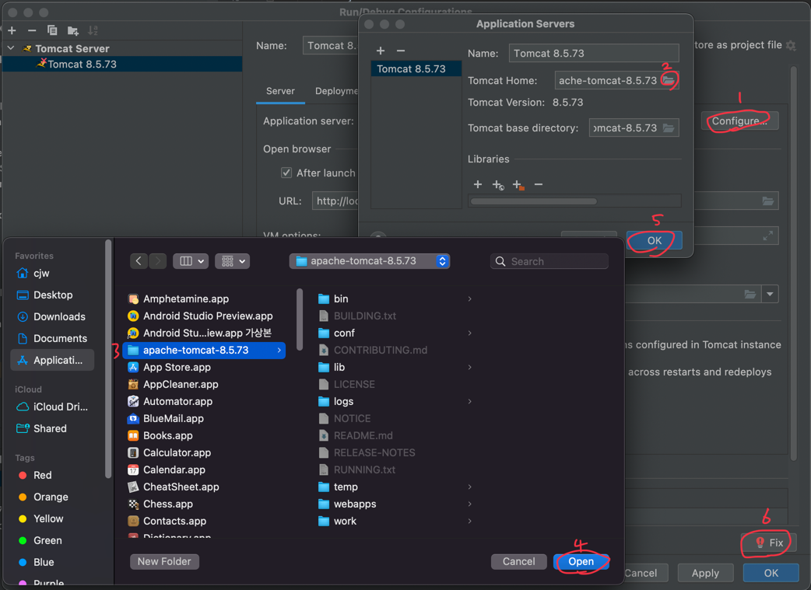

# Spring Version 3.2.18.RELEASE

    mybatis 3.2.2

    mysql-connector

    swagger2.6.1

File - ProjectStructre

if not exsit web in Modules

create -> + -> Web

Depolyment Descriptors Web Module Deployment Desciptor chagned path my dirction "web.xml"

Web Resource Directories Web Reousrce Directory = /webapp/

# File-ProjectStrcutre-Artifacts

Available Elements -> <output root> move refactor

# File/Forder Structre

    /src
        /main
            /java
                /controller
                    MainController.java
                /domain
                    AccountDTO.java
                /repositroy
                    AccountMapper.java
                /service
                    /interfaces
                        IAccountService.java
                    AccountService.java
                /swagger
            /resources
                /common
                    config.xml
                    context-datasource.xml
                    context-mapper.xml
                    mybatis.xml
                /config
                    config.properties
                /mappers
                    AccountMapper.xml
            /webapp
                /resources
                    /css
                /WEB-INF
                    /views
                        test.jsp
                    applicationContext.xml
                    dispatcher-servlet.xml
                    web.xml
                index.jsp
        pom.xml
        startInitStrping.iml

# Mybatis Setting

    /src/main/resources/config/config.properties

# Tomcat Configureation

    run - Edit Configureations...

    -index.jsp
    http://localhost:8080/

    -test.jsp
    http://localhost:8080/test
    
    -mybatis mapper
    http://localhost:8080/account
